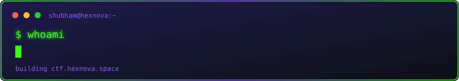

<div align="center">



[](https://ctf.hexnova.space)

</div>

---

## // about

I design, build, and secure **HexNova** — a cyberpunk-themed CTF competition
platform at [ctf.hexnova.space](https://ctf.hexnova.space). I write the
challenges, I break my own infrastructure before anyone else can, and I
document every exploit I find.

```yaml
role      : Cybersecurity Student · CTF Challenge Architect
base      : Nashik, Maharashtra, India
platform  : ctf.hexnova.space
philosophy: "study how systems break, so I can build ones that don't"
```

## // changelog

**🟢 v.current — active**

- building out `ctf.hexnova.space` — challenge catalog, infra hardening, platform security
- designing challenges across **web · crypto · rev · stego · forensics · OSINT**
- running full VAPT engagements against my own platform before players ever touch it

**🟣 v.earlier**

- **La Casa de Papel** — Flask/Jinja2 SSTI chain to RCE, heist-themed
- **Ghost Redirect** — data hidden in raw HTTP 302 bodies, masked via `history.replaceState()`
- **Operation Black Vault** — multi-stage spy-themed CTF, hard difficulty

**⚪ v.foundation**

- networking fundamentals, Linux internals, Kali Linux workflows
- Cisco Networking Fundamentals · NPTEL Cybersecurity

## // stack

**offensive**


**infrastructure**


**languages**


## // hexnova

**[ctf.hexnova.space](https://ctf.hexnova.space)**

Cyberpunk-themed CTF competition platform — self-designed, self-tested,
self-hosted challenges across every major category. Every challenge shipped
goes through my own VAPT process first.

```diff
+ status : LIVE
+ format : CHAKRA{........}
CHAKRA{shu42bham60_pr0f1l3_h4ck3d}
+ theme  : cyberpunk / neon
+ scope  : web · crypto · rev · stego · forensics · osint
```

## // connect

[](https://ctf.hexnova.space)
[](https://cybersec-47e07.web.app)
[](https://discord.gg/3VJzX7bTC)
[](https://www.instagram.com/hexnova.space)
[](https://github.com/hexnovactf)
[](mailto:cybershubhuu@gmail.com)
